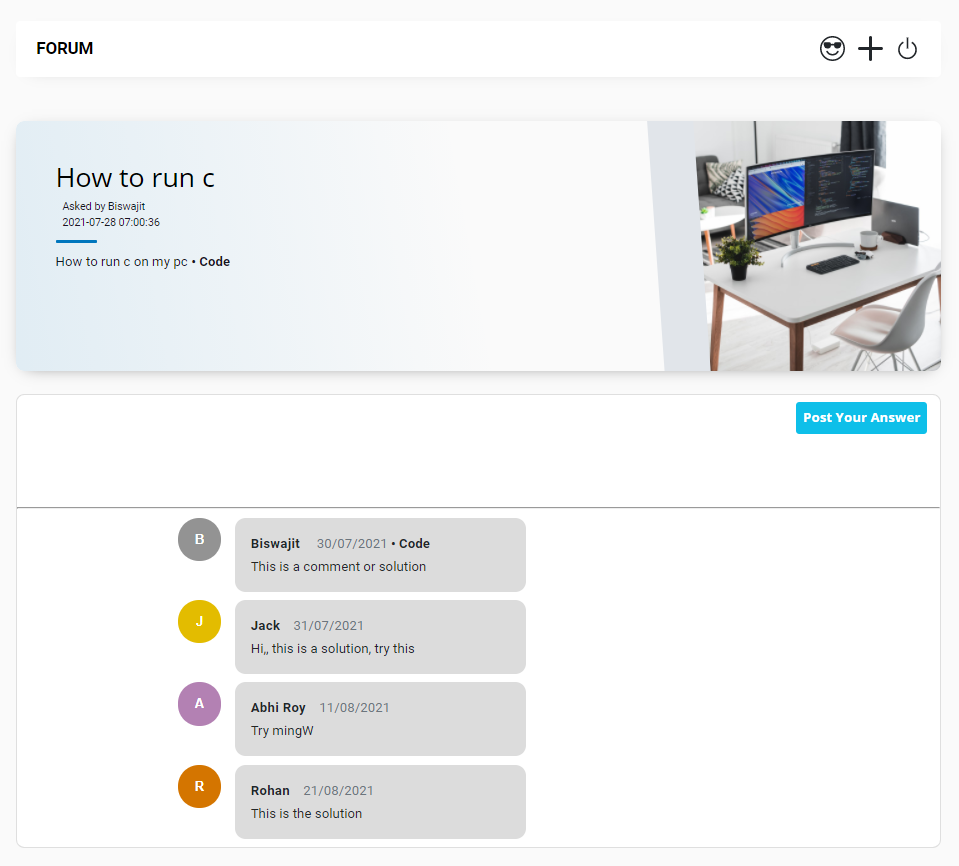

# Forum:
Forum is a question and answer website for programmers. It features questions and answers on a selected category of topics in computer programming. The website serves as a platform for users to ask and answer questions.

-----
## About Laravel:

Laravel is a web application framework with expressive, elegant syntax. We believe development must be an enjoyable and creative experience to be truly fulfilling. Laravel takes the pain out of development by easing common tasks used in many web projects, such as:

- [Simple, fast routing engine](https://laravel.com/docs/routing).
- [Powerful dependency injection container](https://laravel.com/docs/container).
- Multiple back-ends for [session](https://laravel.com/docs/session) and [cache](https://laravel.com/docs/cache) storage.
- Expressive, intuitive [database ORM](https://laravel.com/docs/eloquent).
- Database agnostic [schema migrations](https://laravel.com/docs/migrations).
- [Robust background job processing](https://laravel.com/docs/queues).
- [Real-time event broadcasting](https://laravel.com/docs/broadcasting).

Laravel is accessible, powerful, and provides tools required for large, robust applications.

-----
## Table of Contents:

* [Features](#item1)
* [Forum Overview](#item2)
* [Installation Guide](#item3)
* [Database](#item4)
* [Flowchart](#item5)
* [Screenshots](#item6)

-----

## Features:

* Welcome Page
* Login & Registration
* Email Verification
* Reset Password
* Asking Questions
* Upload Code
* Comment-Reply System
* User Details
* Logout

* Front-end
  * Html, Css, Javascript & Bootstrap
* Backe-end
  * Php & Php Laravel

-----

## Forum Overview:
First of all in Forum’s home page we have a navbar, button for `Login/Registration` page (no can access the next page without login or registration, old user can login to this site and new user have to register as well as have to complete email verification for accessing this site) and `Category(C, C++, JAVA, HTML CSS & JAVASCRIPT, PYTHON & PHP)`. If anyone click on any language category(C, C++, JAVA, HTML CSS & JAVASCRIPT, PYTHON & PHP) example: if I want to go C language category page, then I will click on C category. If user click on any category(C, C++, JAVA, HTML CSS & JAVASCRIPT, PYTHON & PHP), then user will see the all questions(problems) posted or asked by other users related to this category(C, C++, JAVA, HTML CSS & JAVASCRIPT, PYTHON & PHP). If any user click on any question (problem posted by other user) simply they will redirect to this question (problem) page where anyone can give the solution of this problem by comment. Users also have a `mydata` page where they can see their account details and what kind of questions they asked.

-----

## Installation Guide:

* [Step 1: Download the Repository](#step1)
* [Step 2: Run Forum](#step2)

-----

### Step 1: Download the Repository

Either Clone the repository using git clone: `git clone https://github.com/biswajittt/forum.git` 
or install via <a target="_blank" href="https://github.com/biswajittt/forum/archive/master.zip">zip</a> and extract 
to any of your folders you wish.

-----

### Run Forum:

To serve the forum application, you can use `php artisan serve`, then open [http://localhost:8000](http://localhost:8000) from your browser.

-----

## Database:

Import the `forum.sql` file in your phpMyAdmin database.

-----

## Flowchart:

-----

## Screenshots:

